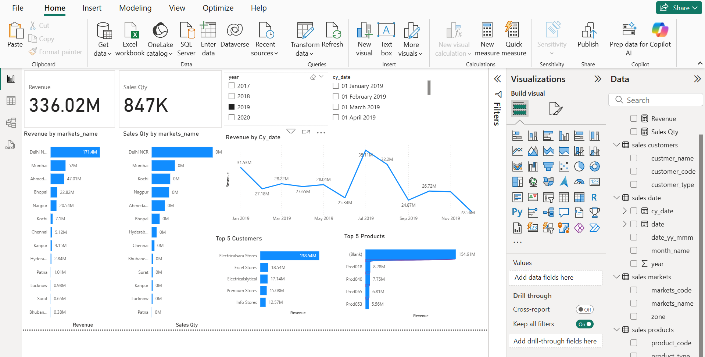

# 📊 Sales Management Dashboard (Power BI + MySQL)

This Power BI project analyzes sales performance using data from a MySQL database. The dashboard includes key performance indicators, sales trends, and regional analysis.

---

## 🚀 Project Highlights
- Revenue & order KPIs
- Time-series analysis by month/quarter
- Region-wise performance
- Product/category breakdowns

---

## 🔧 Tools Used
- Power BI
- MySQL
- DAX
- Power Query

---

## 📂 Files Included
- Sales_Dashboard.pbix – Main Power BI dashboard file
- screenshot.png – Dashboard preview image

---

## ⚠️ Notes
This .pbix file uses a live connection to a MySQL database. It will not display data unless connected to the same source. Screenshots are included to preview the dashboard visuals.

---

## 📸 Preview

